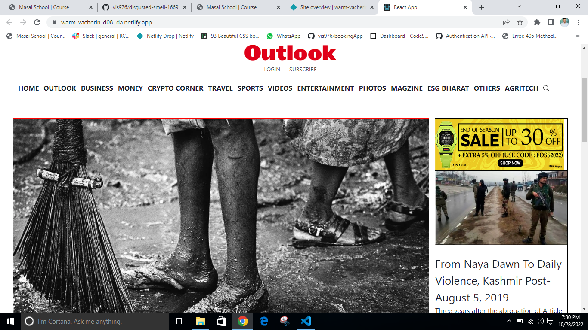

# outlookindia- clone 

Outlook is India’s most credible current affairs and news magazine launched in 1995. Known for its bold and aggressive reporting it continuously raises questions many had in their minds but never dared to ask. Outlook is India’s most readable news website used for online news reading 

This was a solo project of creating outlookindia website. This Project was made as a part of construct week curriculum of MASAI School.

## Demo

Orginal website link: https://www.outlookindia.com/

Cloned website link:  https://warm-vacherin-d081da.netlify.app/

## Tech Stack

**FrountEnd:** React, chakra UI.

## Features

- Working Login/ Sighup. (Using Local Storage)
- Fullscreen mode
- Responsive navbar
- Dynamic News view
- Dynamic Routing by using react-router-dom

- Landing Page

## End Notes

It was an indivisual project that I have built in 5 days after learning react. Implemented frontend. I have used Chakra UI for UI design. I tried to do as much functionality as I could do in just 5 days. Need to fix/ modify the site in some areas. Thank you for visiting my github 🤍.
 
